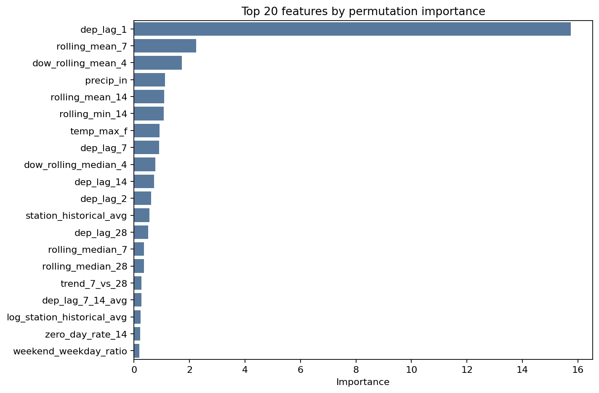
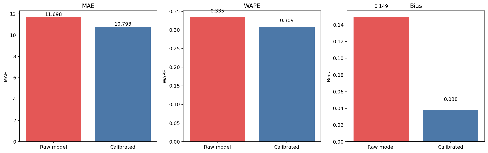
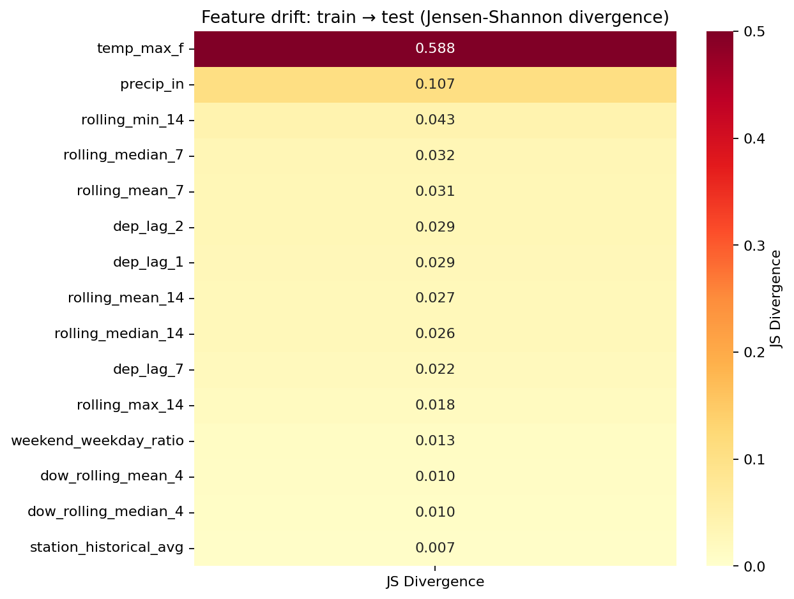
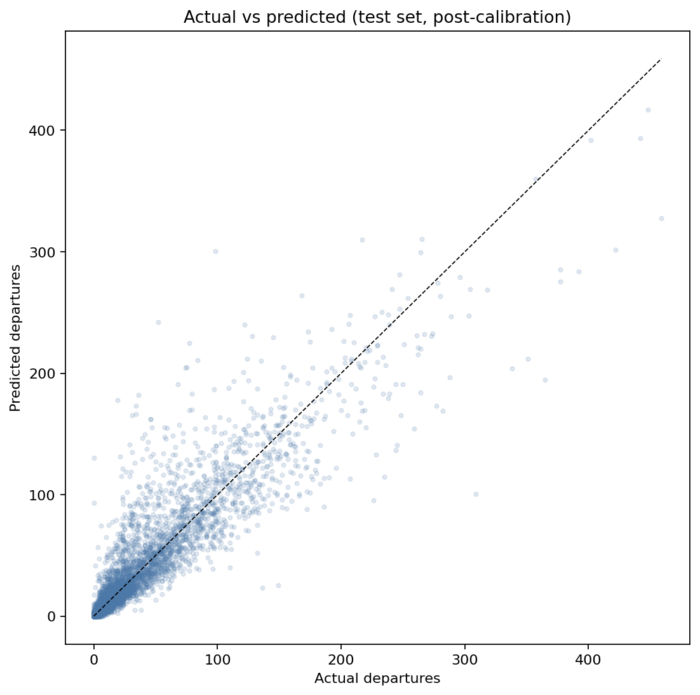

# Station Throughput Lab Report

Generated: 2026-05-08

## Overview

This project predicts next-day bike-station throughput (departures per day per station)
using the public NYC Citi Bike trip dataset. The core challenge: **how do you forecast
throughput for early-life stations when station-specific history is sparse or unavailable?**

The approach combines deep temporal feature engineering, geospatial neighbor features,
hierarchical cold-start imputation, and a calibration-based bias correction layer —
then lets AutoGluon handle model selection and ensembling.

## Data

- **Source:** NYC Citi Bike public trip data
- **Period:** April 2024 – December 2024
- **Grain:** daily departures per station
- **Stations:** 2,279 (after filtering)
- **Spatial clusters:** 2 (DBSCAN on lat/lon)

## Split Summary

| split       |   rows |   stations |   days |   avg_departures |   avg_predicted |   mae |   median_ae |   new_station_share |
|:------------|-------:|-----------:|-------:|-----------------:|----------------:|------:|------------:|--------------------:|
| calibration |  66849 |       2240 |     30 |            55.45 |           61.33 | 11.67 |        4.80 |                0.00 |
| test        |  65965 |       2136 |     31 |            34.94 |           40.16 | 11.70 |        4.57 |                0.00 |
| train       | 476250 |       2274 |    214 |            66.33 |           66.33 |  7.80 |        4.31 |                0.29 |

## Feature Engineering

### Temporal features
- Day-of-week (cyclical encoding), month, quarter, holiday/weekend indicators
- Lag features: 1d, 2d, 7d (same DOW), 14d, 28d
- Rolling statistics: mean/median over 7/14/28-day windows, std over 7/14 days
- DOW-specific rolling mean and median (same weekday over last 4 occurrences)
- Trend ratio: 7-day mean vs 28-day mean
- Coefficient of variation (7-day), zero-day rate (14-day)

### Geospatial features
- DBSCAN spatial cluster membership
- Distance to city center and Manhattan center
- Station density within 1 km radius
- Average distance to k-nearest neighbor stations
- Borough proxy from lat/lon
- **KNN neighbor throughput:** average departures yesterday at the 5 nearest stations

### Weather features
- NOAA Central Park daily observations when available (temperature, precipitation, snow)
- Binary indicators: cold/hot/rainy/snowy days
- Weather × temporal interactions: cold_weekend, rain_weekend, temp_deviation

### Station maturity features
- Station age in days (log-transformed)
- Binary indicators: is_new_station (<60 days), is_very_new (<30 days)
- Historical average throughput (expanding mean — capacity proxy)
- Weekend-vs-weekday throughput ratio

## Cold-Start Imputation

For stations with insufficient history, lag and rolling features are NaN.
The hierarchical imputation fills these using:

1. **Spatial cluster average** — throughput of mature stations in the same DBSCAN cluster,
   scaled by a density ratio (local station density / cluster average density)
2. **Borough average** — fallback when the cluster has no mature stations
3. **City-wide average** — final fallback

## Modeling

AutoGluon TabularPredictor with `best_quality` presets. The framework handles
model selection and ensembling across the installed tabular backends; this run
selected LightGBM-family models under the available local memory and package
constraints. Dynamic stacking is disabled to keep the full run reproducible in
memory-constrained local environments.

AutoGluon reports validation scores as negative MAE because its leaderboard sorts
higher scores first; the reported evaluation metric is still mean absolute error.

Evaluation uses a rolling one-day-ahead setup: lagged station, neighbor, and
network features are based on demand observed through the previous day.

### Model Leaderboard (fitted models)

| model               |   score_val | eval_metric         |   pred_time_val |   fit_time |   pred_time_val_marginal |   fit_time_marginal |   stack_level | can_infer   |   fit_order |
|:--------------------|------------:|:--------------------|----------------:|-----------:|-------------------------:|--------------------:|--------------:|:------------|------------:|
| WeightedEnsemble_L3 |      -8.520 | mean_absolute_error |          13.108 |    848.005 |                    0.003 |               0.186 |             3 | True        |           4 |
| LightGBMXT_BAG_L1   |      -8.535 | mean_absolute_error |           8.765 |    566.120 |                    8.765 |             566.120 |             1 | True        |           1 |
| WeightedEnsemble_L2 |      -8.535 | mean_absolute_error |           8.769 |    566.138 |                    0.004 |               0.018 |             2 | True        |           2 |
| LightGBMXT_BAG_L2   |      -8.653 | mean_absolute_error |          13.105 |    847.819 |                    4.340 |             281.699 |             2 | True        |           3 |

### Feature Importance (calibration split, top 15)

| feature                |   importance |   stddev |   p_value |   n |   p99_high |   p99_low |
|:-----------------------|-------------:|---------:|----------:|----:|-----------:|----------:|
| dep_lag_1              |      15.7379 |   0.0195 |    0.0003 |   2 |    16.6147 |   14.8611 |
| rolling_mean_7         |       2.2413 |   0.0320 |    0.0032 |   2 |     3.6797 |    0.8030 |
| dow_rolling_mean_4     |       1.7248 |   0.0593 |    0.0077 |   2 |     4.3921 |   -0.9425 |
| precip_in              |       1.1214 |   0.0260 |    0.0052 |   2 |     2.2924 |   -0.0497 |
| rolling_mean_14        |       1.0836 |   0.0081 |    0.0017 |   2 |     1.4481 |    0.7191 |
| rolling_min_14         |       1.0679 |   0.0116 |    0.0024 |   2 |     1.5898 |    0.5460 |
| temp_max_f             |       0.9218 |   0.0449 |    0.0110 |   2 |     2.9423 |   -1.0988 |
| dep_lag_7              |       0.9018 |   0.0552 |    0.0138 |   2 |     3.3859 |   -1.5823 |
| dow_rolling_median_4   |       0.7707 |   0.0765 |    0.0223 |   2 |     4.2138 |   -2.6724 |
| dep_lag_14             |       0.7292 |   0.0517 |    0.0159 |   2 |     3.0547 |   -1.5964 |
| dep_lag_2              |       0.6203 |   0.0585 |    0.0212 |   2 |     3.2532 |   -2.0126 |
| station_historical_avg |       0.5614 |   0.0583 |    0.0233 |   2 |     3.1860 |   -2.0631 |
| dep_lag_28             |       0.5144 |   0.0217 |    0.0095 |   2 |     1.4899 |   -0.4611 |
| rolling_median_7       |       0.3688 |   0.0681 |    0.0413 |   2 |     3.4346 |   -2.6969 |
| rolling_median_28      |       0.3573 |   0.0257 |    0.0162 |   2 |     1.5149 |   -0.8004 |



## Calibration & Bias Correction

The raw ML model learns relative patterns (which features matter, how they interact)
but can be systematically biased on the absolute level — especially when the test
period has different demand characteristics than training. This is the standard
"forecast reconciliation" problem in demand planning.

### Methodology

We apply a **hierarchical multiplicative correction** estimated from the held-out
calibration set (November). For each segment, the correction factor is:

```
factor = mean(actual) / mean(predicted)    on calibration data
```

The hierarchy, from most specific to most general:

| Level | Granularity | Factors | Min sample |
|-------|------------|---------|------------|
| Station | Per station | 2,229 | 14 rows |
| Cluster × DOW | Spatial cluster + day-of-week | 7 | 30 rows |
| Borough × DOW | Borough + day-of-week | 28 | 50 rows |
| Global | Single factor for all | 1 | all calibration |

Each prediction is corrected by the most specific factor available. Station-level
factors override cluster-level, which override borough-level, which override global.
For stations without calibration history, the method falls back to cluster,
borough, or global factors.

**Why hierarchical?** A global correction factor (here: 0.904) applies the same
adjustment everywhere. But a Manhattan commuter station on a Monday behaves very
differently from a Queens park station on a Saturday. The hierarchical approach
captures these segment-specific biases while falling back to broader corrections
when segment-level data is sparse.

### Results

| Metric | Raw Model | After Calibration | Improvement |
|--------|-----------|-------------------|-------------|
| MAE | 11.70 | 10.79 | 7.7% |
| WAPE | 0.335 | 0.309 | 7.7% |
| Bias | +0.149 | +0.038 | near-zero |



The calibration layer reduced test MAE by **7.7%** and nearly
eliminated systematic bias (+0.149 → +0.038).
This is a non-parametric correction that requires no retraining — it can be
updated daily as new calibration data arrives, making it suitable for
rolling operational forecasts.

## Baseline Skill Check

Simple rolling baselines are the right yardstick for this forecasting task. The
skill column is measured against the strongest baseline WAPE, so positive values
mean the model improves on the best simple operational rule.

| method                 | kind     |    mae |   median_ae |   wape |   bias |   wape_skill_pct |
|:-----------------------|:---------|-------:|------------:|-------:|-------:|-----------------:|
| Yesterday              | baseline | 10.964 |       5.000 |  0.314 | -0.007 |            0.000 |
| Same weekday last week | baseline | 16.719 |       6.000 |  0.479 |  0.093 |          -52.489 |
| Rolling 7-day mean     | baseline | 12.569 |       4.857 |  0.360 |  0.018 |          -14.644 |
| Rolling 28-day mean    | baseline | 14.016 |       5.500 |  0.401 |  0.253 |          -27.841 |
| Same-DOW rolling mean  | baseline | 16.140 |       6.250 |  0.462 |  0.319 |          -47.213 |
| Raw ML model           | model    | 11.698 |       4.575 |  0.335 |  0.149 |           -6.700 |
| Calibrated ML model    | model    | 10.793 |       4.407 |  0.309 |  0.038 |            1.557 |

## Distribution Shift Analysis

A model trained on April–October and tested on December faces seasonal distribution
shift. Understanding *which* features drifted and *how much* explains the raw model's
bias and validates the calibration approach.

### Target Variable Drift

| Split | Mean | Median | Std |
|-------|------|--------|-----|
| Train (Apr–Oct) | 66.33 | 30.0 | 85.61 |
| Calibration (Nov) | 55.45 | 23.0 | — |
| Test (Dec) | 34.94 | 15.0 | 47.62 |

JS divergence: train→test = 0.0281, train→cal = 0.0031, cal→test = 0.0121

December demand is **lower** than the training average because the training period
includes peak summer months (June–September) when cycling demand is highest. The
model's lag and rolling features carry forward recent values, while weather
features, especially temperature, shift substantially.

### Feature Drift (Top Features by JS Divergence)

| feature                |   js_divergence |   train_mean |   test_mean |   shift_pct | drift_severity   |
|:-----------------------|----------------:|-------------:|------------:|------------:|:-----------------|
| temp_max_f             |          0.5883 |        76.26 |       43.56 |       -42.9 | severe           |
| precip_in              |          0.1069 |         0.1  |        0.15 |        41.3 | moderate         |
| rolling_min_14         |          0.0425 |        37.19 |       14.45 |       -61.1 | minimal          |
| rolling_median_7       |          0.032  |        66.59 |       34.65 |       -48   | minimal          |
| rolling_mean_7         |          0.0311 |        66.05 |       35.57 |       -46.1 | minimal          |
| dep_lag_2              |          0.0294 |        66.21 |       34.31 |       -48.2 | minimal          |
| dep_lag_1              |          0.0286 |        66.25 |       34.68 |       -47.7 | minimal          |
| rolling_mean_14        |          0.0269 |        65.4  |       38.44 |       -41.2 | minimal          |
| dep_lag_7              |          0.0219 |        66.25 |       38.2  |       -42.3 | minimal          |
| dep_lag_14             |          0.0145 |        66.07 |       43.43 |       -34.3 | minimal          |
| rolling_median_28      |          0.0136 |        65.23 |       44.31 |       -32.1 | minimal          |
| dow_rolling_mean_4     |          0.0101 |        64.55 |       46.08 |       -28.6 | minimal          |
| dow_rolling_median_4   |          0.0097 |        65.27 |       46.32 |       -29   | minimal          |
| dep_lag_28             |          0.009  |        65.95 |       54.49 |       -17.4 | minimal          |
| station_historical_avg |          0.007  |        56.79 |       65.91 |        16.1 | minimal          |



**1 of 15 top features** shows substantial or severe drift.
The main drift pattern is:

- **Temperature features** — December is colder than the Apr–Oct training period,
  making `temp_max_f` the dominant shifted feature among the important features
- **Precipitation features** — precipitation shifts moderately and contributes
  meaningful weather context
- **Lag and rolling demand features** — these retain relatively stable distribution
  shape even though their means fall with winter demand

Features with **low drift** (lag features, DOW indicators) are the model's anchor —
they generalize well across seasons because they capture relative patterns rather
than absolute levels. This is why the model's relative station ranking remains
useful (low median AE) even when the *level* is off (high bias before calibration).

## Test Set Results (Post-Calibration)

| Metric | Value |
|--------|-------|
| MAE | 10.79 |
| Median AE | 4.41 |
| RMSE | 20.26 |
| WAPE | 0.309 |
| Bias | +0.038 |



## Cold-Start vs Mature Stations (Post-Calibration)

|   rows |   stations |   avg_actual |   avg_predicted |    mae |   median_ae |   rmse |   wape |   bias | segment    |
|-------:|-----------:|-------------:|----------------:|-------:|------------:|-------:|-------:|-------:|:-----------|
|    165 |          7 |       39.994 |          40.498 | 13.808 |       7.905 | 21.214 |  0.345 |  0.013 | cold_start |
|  65800 |       2131 |       34.925 |          36.252 | 10.785 |       4.400 | 20.253 |  0.309 |  0.038 | mature     |

The cold-start MAE gap is **28.0%** higher than mature stations after
calibration. This table measures final forecast performance for early-life
stations, not the isolated effect of imputation alone.

## Accuracy by Station Volume

| volume_segment   |   rows |   stations |   avg_train_departures |   avg_actual |    mae |   median_ae |   wape |   bias |
|:-----------------|-------:|-----------:|-----------------------:|-------------:|-------:|------------:|-------:|-------:|
| low_volume       |  21925 |        710 |                  9.638 |        4.926 |  2.327 |       1.811 |  0.472 | -0.174 |
| medium_volume    |  21962 |        710 |                 36.638 |       18.634 |  5.859 |       4.493 |  0.314 |  0.004 |
| high_volume      |  21927 |        711 |                161.045 |       81.244 | 24.176 |      17.251 |  0.298 |  0.059 |
| no_train_history |    151 |          5 |                nan     |       39.483 | 14.255 |       8.390 |  0.361 |  0.014 |

## Accuracy by Borough

|   rows |   stations |   avg_actual |   avg_predicted |    mae |   median_ae |   rmse |   wape |   bias | borough   |
|-------:|-----------:|-------------:|----------------:|-------:|------------:|-------:|-------:|-------:|:----------|
|  22066 |        716 |       73.492 |          77.982 | 22.182 |      14.212 | 32.869 |  0.302 |  0.061 | Manhattan |
|  17242 |        557 |       24.287 |          24.523 |  7.559 |       4.272 | 12.099 |  0.311 |  0.010 | Brooklyn  |
|  14175 |        459 |       11.763 |          11.212 |  3.920 |       2.655 |  5.726 |  0.333 | -0.047 | Queens    |
|  12482 |        404 |        7.809 |           7.173 |  2.931 |       2.086 |  4.358 |  0.375 | -0.081 | Bronx     |

## Accuracy by Day of Week

| dow_name   |   rows |   avg_actual |    mae |   wape |
|:-----------|-------:|-------------:|-------:|-------:|
| Mon        |  10632 |       34.228 | 10.657 |  0.311 |
| Tue        |  10606 |       41.027 | 14.003 |  0.341 |
| Wed        |   8526 |       35.030 | 12.285 |  0.351 |
| Thu        |   8523 |       39.563 |  8.634 |  0.218 |
| Fri        |   8522 |       37.337 |  6.980 |  0.187 |
| Sat        |   8513 |       27.241 | 10.090 |  0.370 |
| Sun        |  10643 |       30.034 | 11.879 |  0.396 |

## Lessons Learned

### 1. Data ingestion bugs are the most expensive bugs

The Citi Bike monthly zip files contain multiple CSV shards (3–6 per month), so
the ingestion step reads every CSV in each archive and validates the resulting
station-day panel. Reading only the first shard would silently drop most trips
and create artificial zero-departure days. The same issue appears at the station
lifecycle level: zero-filled dates should be kept only between a station's first
and last observed trip, not after a station disappears from the feed.

### 2. Separate signal learning from level correction

The ML model learns *relative* patterns: which stations are busier,
how weekdays differ from weekends, how rain suppresses demand. But it can be
systematically wrong on the *absolute level* when the test period differs from
training. The calibration layer corrects the level without retraining, using the
same hierarchical approach as production demand planning systems. This separation
of concerns (model for signal, calibration for level) is more robust than trying
to make the model do both.

### 3. Drift analysis explains model failures

Computing JS divergence between train and test distributions for each feature
reveals *why* the raw model is biased. Features with high drift (seasonal
indicators, temperature) explain the level shift. Features with low drift
(lag features, DOW patterns) explain why the model's relative predictions are
still useful. This diagnostic should be standard in any ML pipeline with
temporal splits.

### 4. Hierarchical corrections outperform global corrections

A single global correction factor applies the same adjustment to every station
and every day. But demand patterns vary by borough, day-of-week, and individual
station. The hierarchical approach (station → cluster×DOW → borough×DOW → global)
captures these segment-specific biases while maintaining statistical stability
through minimum sample requirements at each level.

### 5. Cold-start imputation works but has limits

Hierarchical spatial imputation (cluster → borough → city average), followed by
the calibration layer, gives early-life stations reasonable final forecasts during
sparse-history periods. The post-calibration cold-start MAE gap (28.0%
higher than mature) is directionally useful but should be monitored. The gap
narrows as the station accumulates history and its own lag features become available.
